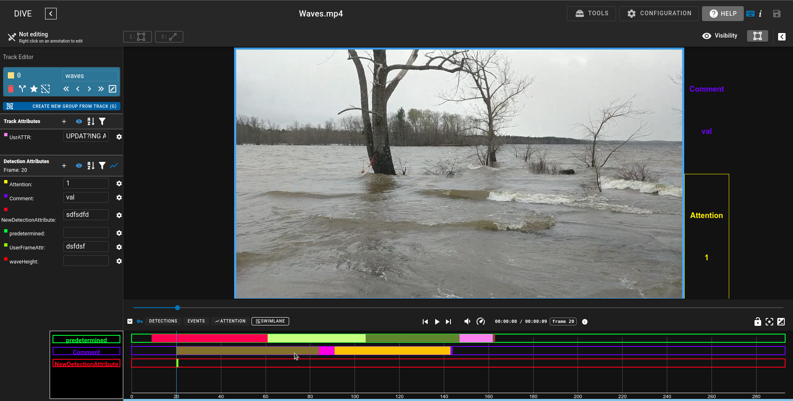
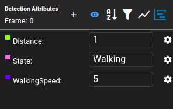
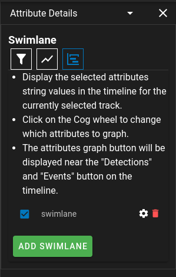

# Attribute Swimlane Graph

Attributes of type string can also be graphed in the timeline where each attribute has a swimlane where the values change over time.

Swimlanes are configured similar to the Numerical Timelines for Detection attributes.  In the Attributes setting there is a simlane icon ==:material-chart-timeline:== which can be clicked to open the side bar to the swimlane attributes settings.

## Swimlane Timeline Graphs

Multiple swimlanes can be added and enabled from this menu and existing ones can be modified.

Clicking on the settings will bring up the Settings Editor for attributes.

## Swimlane Settings

Simply use the key filter to select the attributes you whish to graph and configure it to be enabled or default to show the graph button in the timeline area.

If you are creating a swimlane for a numerical attribute, utilize the value colors to create a color gradient which can be used to represent the values.

## Swimlane Key

When viewing the swimlane graph a floating 'key' shows up on the left hand side of the graph.  This is used to determine which attribute is being graphed.
Hovering over the attribute name will show the colors associated with the attribute and the value.  Hovering over any color in the swimlane will show the Attribute name and the value as well as the color for that value.
