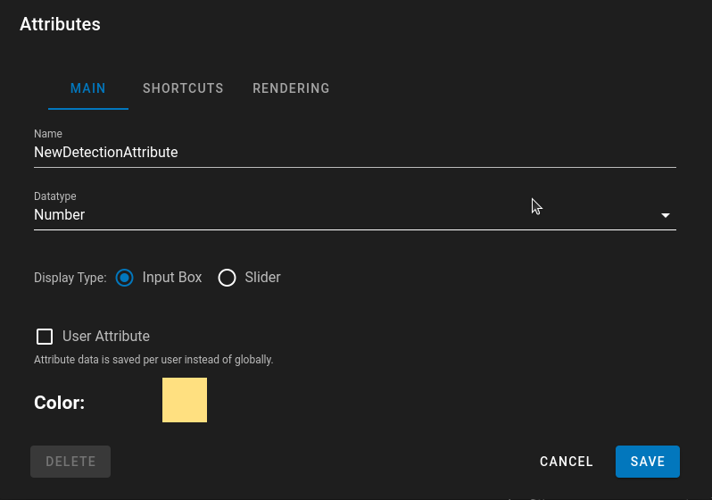
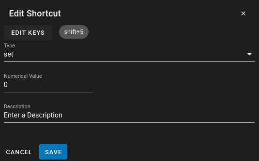

# Attributes

## Concepts and Terms

- **Attribute Definitions** are templates.  They have a name and a value type, such as `String`, `Number`, or `Boolean`.  Definitions must be created before attribute values can be assigned.  Tracks and detections each have their own set of definitions.
- **Track Attributes** apply to an entire track. Each track can only have one value for each track attribute definition.
- **Detection Attributes** can be different for every frame in a track.

### Example Attribute Definition

- Track Attributes:
    - CompleteTrack: `Boolean`
    - FishLength: `number (cm)`
- Detection Attributes:
    - Swimming: `Boolean`
    - Eating: `Boolean`

### Example Attribute Values

- Fish Track 1
    - Track Attributes
        - `{ "FishLength": 20 }`
    - Detection Attributes
        - Frame 1
            - `{ "Eating": True }`
        - Frame 2
            - `{ "Swimming": False, "Eating": True }`

!!! Info

    All Attribute definitions do not need to be assigned to values.  CompleteTrack (Track Attribute) and Swimming for Frame 1 (Detection Attribute) weren't assigned in this example.

## Using the Attributes Panel

{ align=right width=260px }

1. Select an existing track or detection with left click.
1. Open the Track Details page by clicking on the ==:material-swap-horizontal:== button in the [Type List](UI-Type-List.md) area or pressing the ++a++ key.
1. Here you will see the track/detection type, confidence pairs associated with it and then a list of track and detection attributes.
1. For attributes there are two sections
    1. **Track Attributes** - All track level attributes
    1. **Detection Attributes** - attributes associated with the track on a per frame basis
1. Attributes can be sorted by their name (alphabetically) or by their numeric value.  Clicking on the ==:material-sort-alphabetical-ascending:== or the ==:material-sort-numeric-ascending:== button will swap between the two.
1. Attribute Filtering
    1. The Attribute filtering icon ==:material-filter:== will change color when filtering is being applied.
    1. Clicking on the filter icon will bring up the Attribute Details Panel where **[Attributes Filtering](UI-AttributeFiltering.md)** and **[Attributes Timeline Graphing](UI-AttributeTimeline.md)** can be done.

!!! info

    Attributes found during import in a [VIAME CSV](DataFormats.md#viame-csv) will automatically show up in the list.  The data type of the attribute is guessed by examining values and may need to be manually corrected.

By default, all attributes associated with the dataset are visible and editable.  You can hide unused attributes by clicking the ==:material-eye:== toggle next to ==:material-plus: Attribute==.

| Show Unused ==:material-eye:== | Hide Unused ==:material-eye-off:== |
|-------------|-------------|
 | 

## Creating Attribute Definitions

1. Click on the ==:material-plus: Attribute== icon for in either the track or detection attribute area.
    1. 
1. Enter a unique name
1. Choose a Datatype
    1. `Number`
    1. `Boolean` (True/False)
    1. `Text`
        1. Custom text that the user provides
        1. A predefined list of text to choose from, separated by newline.
1. Click ==Save== to add the new attribute

## Editing Attribute Definitions

Click the ==:material-cog:== button next to an existing attribute to edit its definition.

!!! warning

    Editing or deleting an attribute **definition** doesn’t change any existing attribute **values**.

    * **Deleting** an attribute definition will cause it to disappear from the list, but the values will remain in the database.
    * **Editing** an attribute definition will change the way the controls behave, but will not change any existing set values.

* *User Attribute* - This flag will set the attribute so that the storage of data is per user instead of globally.  By defauly attributes are stored on the dataset and are universal for each user that views/edits the dataset.  If this flag is set the attributes will be per user so that different user's when setting attributes will see different values.  This is stored in the TrackJSON structure under 'UserAttributes' key for track and detection attributes.  There is a new Sidebar called User Attribute Review which allows for reviewing of all user attributes.
* *Color* - Allows specification of a custom color to represent the attribute when filtering or when graphing the attribute value

## Attribute Shortcuts

A specific key shortcut can be assigned to setting the value of an attribute.  When the user presses this key combination the Attribute can be set, unset, or prompt the user for a value.

* *Edit Keys* - After clicking this button put in a keyboard combination which you want to use to assign a value to the attribute.  There are reserved shortcuts and the dialog will inform you if you're using a reserved shortcut.
* *Type* 
    * *set* - set the value to a specific defined numerical/text/boolean value
    * *remove* - removes the value from the attribute and resets it back to empty
    * *dialog* - a dialog pops open asking the user for input for the attribute value
* *Description* - a text based description of the shortuct.  This description is used in the Help dialog to show what all the keyboard shortcuts are.

In the upper right of the screen the keyboard icon is used to toggle on/off system and attribute shortcuts.
The info icon next to it will display a list of possible shortcuts that are set and will use the Description to explain what a shortcut does.

## Setting Attribute Values

1. Click on the attribute value when in viewing mode to edit and set the attribute
1. Or directly edit the value field when in the attribute editing mode
1. Setting an attribute to the empty value will remove the value from the track/detection

## Importing and Exporting Attributes

Attributes are part of the dataset configuration that can be imported and exported.

1. Set up a dataset with all the attributes you need
1. In the ==:material-download: Download== menu, choose ==Configuration==.
1. Use this configuration with other datasets
    1. Use the ==:material-application-import: Import== button to load this configuration to other datasets.
    1. Upload the configuration file when you create new datasets to initialize them with these attribute definitions.

## Applying Attributes Demo

